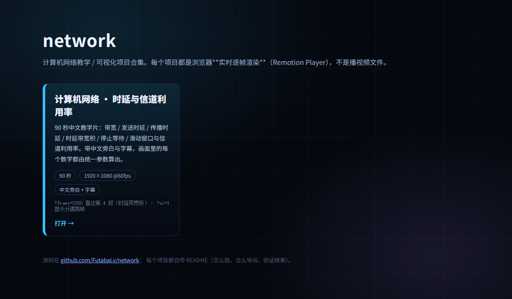

# network

计算机网络相关的教学 / 可视化项目合集（monorepo）。每个项目独立放在 `projects/<名字>/`，各有自己的 `package.json`、README 和校验脚本。

## 项目索引

| 项目 | 内容 | 产物 | 怎么看 / 怎么跑 |
|---|---|---|---|
| [network-delay-mv](projects/network-delay-mv/) | **90 秒中文教学片**：带宽 / 发送时延 / 传播时延 / 时延带宽积 / 停止等待 / 滑动窗口与信道利用率。Remotion 逐帧渲染，1920×1080@60fps，含中文旁白与字幕（24 条） | [`network-delay.mp4`](projects/network-delay-mv/network-delay.mp4)（90.005 s / 11.1 MB）、在线观看 **https://futabaly.github.io/network/network-delay-mv/** | `cd projects/network-delay-mv && npm i && npm run narration && npm run render` |

## 在线站点

一个仓库只有一个 GitHub Pages 站点，所以**根地址是门户页，各项目挂在子路径**（以后加片子不会互相占位）：

| 地址 | 内容 |
|---|---|
| https://futabaly.github.io/network/ | 门户页：项目卡片索引（按 `projects.json` 生成） |
| https://futabaly.github.io/network/network-delay-mv/ | 这个片子（浏览器实时渲染，带旁白与字幕） |



## 目录约定

```
projects/<项目名>/        每个项目自成一体
  src/                    源码（画面全部由代码生成，不放素材）
  docs/                   说明、验证文档、成片抽帧
  <成片>.mp4              成品直接放项目根目录，方便点开就看
  README.md               怎么跑、怎么导出、验证结果
.github/workflows/        CI：对每个项目跑类型检查 + 数值自检
```

## 加一个新项目

1. `mkdir -p projects/<名字>`，把工程放进去（照着 `network-delay-mv` 的结构来）；
2. 项目里至少要有 `README.md`（运行/导出说明）和 `npm run check`（类型检查 + 数值自检）；
3. 在上面的**项目索引**表里加一行；
4. 在 `projects.json` 里加一条（门户页的卡片就出来了，URL 即 `/network/<项目目录>/`）；
5. 把项目名加进 `.github/workflows/check.yml` 的 `matrix.project` 列表（一处）；
5. 成品（视频/图/文档）放项目根目录或 `docs/`；`node_modules/`、`out/`、`dist/` 这些中间产物别提交 —— 各项目的 `.gitignore` 已经写好了。

## 跨项目约定（复用同一套做法）

- **视频类项目用 Remotion**：React 写动画、逐帧渲染；同一套代码既能出 MP4，也能用 `@remotion/player` 在浏览器实时播（`npm run web:dev`）。
- **单一参数源**：画面里出现的每个数字（公式、时间轴、动画位置、结论卡）都从一个参数文件算出来，结构上排除「公式与动画互相矛盾」。
- **中文旁白用 edge-tts**（`zh-CN-XiaoxiaoNeural`，语速可调）逐条合成并 ffprobe 实测时长；**字幕与画面字幕层同源**，再导出 `.srt`。
- **交付四件套**：成片 MP4 + 可编辑源码（含运行/导出说明）+ 中文旁白稿与字幕 + 验证说明。
- **导出前逐帧检查**：渲染每个分镜的代表帧目检文字是否溢出/压字、字幕是否同步、数字是否正确，改完重渲染复看。

## CI

`.github/workflows/check.yml` 对索引里的每个项目跑 `npm ci && npm run check`（类型检查 + 数值自检）与 `npm run web:build`，push / PR 都会触发。