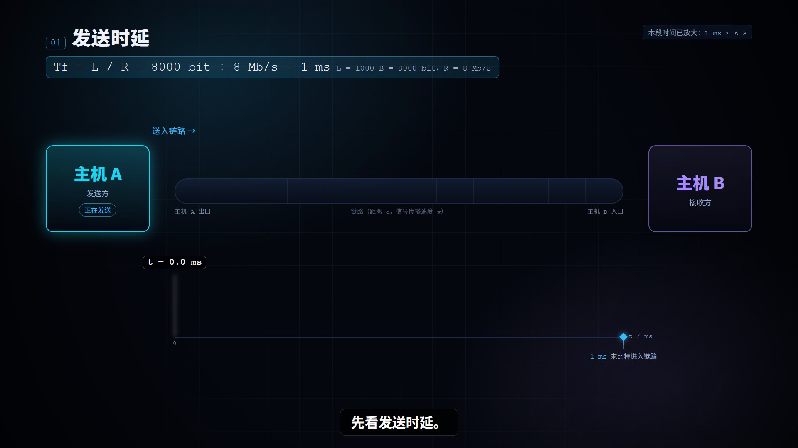
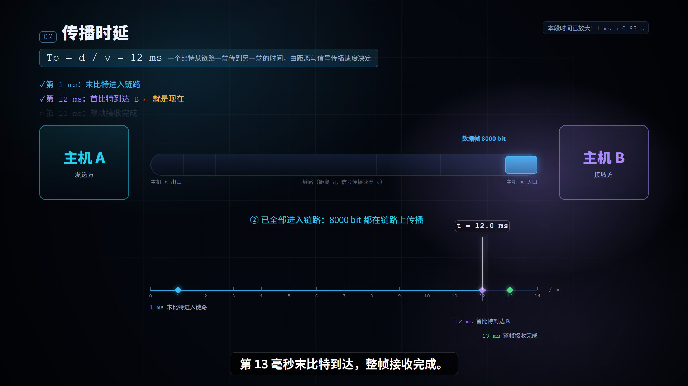
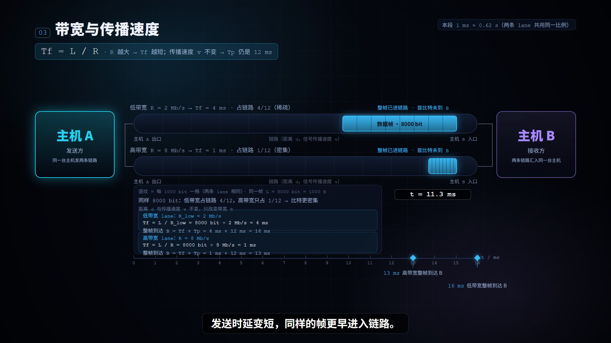
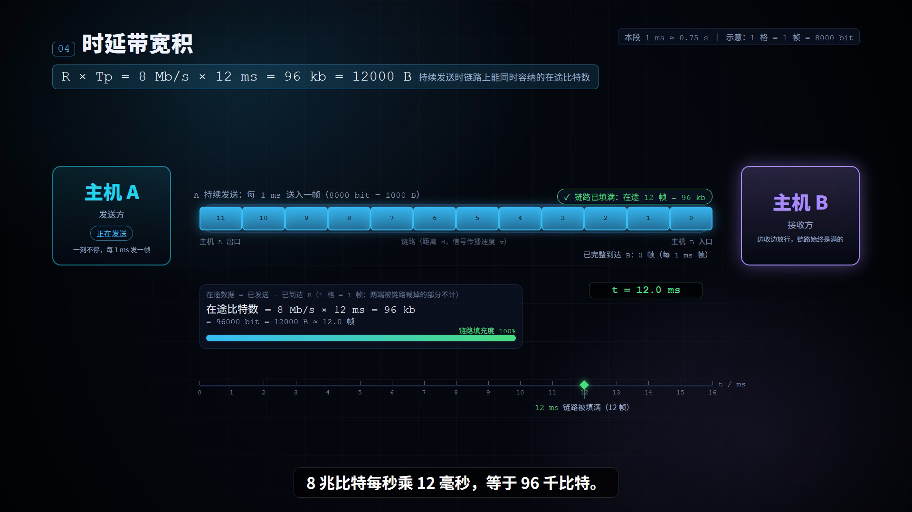
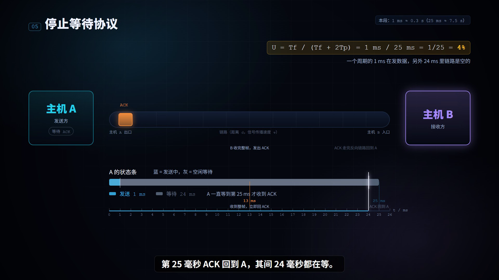
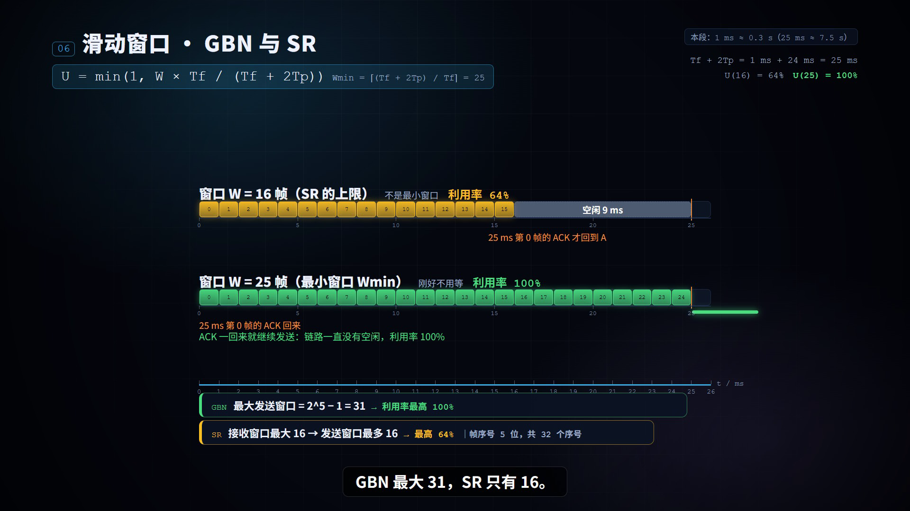

# 计算机网络 · 时延与信道利用率（Remotion 教学动画）

一段 **90 秒**的中文教学短片，讲清楚：**带宽、发送时延、传播时延、时延带宽积，以及滑动窗口如何影响信道利用率**。
面向考研 408 复习：画面简洁、公式与时间轴同步、中文旁白 + 字幕。

**16:9 · 1920×1080 · 60fps** ，用 [Remotion](https://remotion.dev)（React 写动画、逐帧渲染）制作，全部素材由代码生成（没有图片/视频素材）。

## 交付物

| 文件 | 说明 |
|---|---|
| `network-delay.mp4` | 成片（90 s，1920×1080，60fps，含中文旁白与字幕） |
| `subtitles/narration.srt` | 字幕文件（与画面里的字幕同源，可直接用于播放器/剪辑软件） |
| `docs/narration.md` | 中文旁白稿（含每条实测时长与分镜余量） |
| `docs/verification.md` | 验证说明（数值自检 / 代表帧检查 / 成片复核） |
| `src/` `audio/` `scripts/` | 完整可编辑源码、旁白生成脚本、字幕与自检脚本 |
| `web/` | 网页实时版（`npm run web:dev`，用 Remotion Player 在浏览器里实时渲染同一套动画） |

## 统一参数（唯一真相：`src/sim.ts`）

画面上的**每一个数字**——公式、时间轴刻度、事件时刻、位置——都从这一个文件算出来，改这里全片自动跟着变。

| 量 | 值 | 说明 |
|---|---|---|
| 带宽 R | 8 Mb/s | 8×10⁶ bit/s（十进制通信单位） |
| 数据帧长 L | 1000 B = 8000 bit | |
| 单向传播时延 Tp | 12 ms | 由距离与信号传播速度决定 |
| 发送时延 Tf = L/R | **1 ms** | 8000 bit ÷ 8000 bit/ms |
| 时延带宽积 R×Tp | **96 kb = 12000 B** | 链路能同时容纳 12 帧的比特 |
| 往返传播时延 RTT | 24 ms | 本片只计往返传播，忽略 ACK 发送时间 |
| 发一帧→收到确认 | 25 ms | Tf + 2Tp = 1 + 24 |
| 帧序号 | 5 位 → 32 个 | GBN 最大窗口 31，SR 最大窗口 16 |
| 最小不停顿窗口 Wmin | 25 | ⌈(Tf+2Tp)/Tf⌉ |
| 停止等待利用率 | 4% | Tf/(Tf+2Tp) = 1/25 |

## 成片画面

下面 6 张是从**最终 MP4** 里直接抽出来的帧（1 / 26 / 38 / 55 / 68 / 88 秒），也就是交付视频的实际画面：

| 01 发送时延 | 02 传播时延 | 03 带宽与传播速度 |
|---|---|---|
|  |  |  |

| 04 时延带宽积 | 05 停止等待 | 06 滑动窗口 · GBN / SR |
|---|---|---|
|  |  |  |

## 分镜

| # | 时间 | 知识点 | 画面要点 | 公式 |
|---|---|---|---|---|
| 01 | 0–15 s | 发送时延 | A 把一帧**逐比特**送入链路，标出首比特/末比特，时间轴 0→1 ms | Tf = L/R = 1 ms |
| 02 | 15–30 s | 传播时延 | 追踪首比特 A→B，区分「正在发送」与「已在链路传播」，标出 1/12/13 ms | Tp = d/v = 12 ms |
| 03 | 30–45 s | 带宽 vs 传播速度 | 上下两条泳道对比 R=2 Mb/s 与 R=8 Mb/s：帧更早进入链路、比特更密集，但 v 不变 | Tf = L/R |
| 04 | 45–60 s | 时延带宽积 | A 持续发送，12 ms 后链路被 12 帧填满，圈出在途数据（注明示意比例） | R×Tp = 96 kb = 12000 B |
| 05 | 60–75 s | 停止等待 | 发 1 ms、等 24 ms；13 ms B 回 ACK、25 ms 到达 A | U = Tf/(Tf+2Tp) = 4% |
| 06 | 75–90 s | 滑动窗口 / GBN / SR | 上下两条时间轴对比 W=16（有 9 ms 空闲，64%）与 W=25（无空闲，100%）+ 结论卡 | U = min(1, W·Tf/(Tf+2Tp))，Wmin = 25 |

## 时间映射

题目要求「1 ms ≈ 0.3 s」。本片按分镜决定缩放，**同一分镜内所有事件共用同一个比例**，所以时间关系不会失真；每段右上角的角标会写明本段的缩放比：

| 分镜 | 每毫秒对应 | 覆盖的模拟时间 | 说明 |
|---|---|---|---|
| 01 | 6 s / ms | 0–1 ms | 放大到看得清「逐比特进入链路」 |
| 02 | 0.85 s / ms | 0–13 ms | 看清首比特/末比特到达 |
| 03 | 0.62 s / ms | 0–16 ms | 两条泳道对比 |
| 04 | 0.75 s / ms | 0–16 ms | 等链路填满再圈注 |
| 05 | 0.3 s / ms | 0–25 ms | 题目建议比例 |
| 06 | 0.3 s / ms | 0–25 ms | 两条时间轴对比 |

## 运行

```bash
npm install

npm run studio        # Remotion Studio 预览（改代码即时看）
npm run web:dev       # 网页实时版（浏览器里实时渲染同一套动画）
npm run still         # 渲染一帧 out/still.png

npm run narration     # 生成中文旁白 mp3（edge-tts）并同步到 public/
npm run subs          # 导出 subtitles/narration.srt 并重新生成 docs/narration.md（旁白稿）
npm run render        # 导出成片 out/network-delay.mp4
npm run verify        # 用 ffprobe 复核成片属性，并抽 6 张关键帧到 out/verify/
npm run check         # 类型检查 + 数值自检（30 项断言）
```

只想出片：`npm install && npm run narration && npm run render`。
想改文案/节奏：改 `src/narration.ts`（旁白与字幕的唯一来源）或 `src/sim.ts`（参数），再重跑 `npm run narration && npm run subs && npm run render`。

## 目录结构

```
src/
  sim.ts              ★ 统一参数 + 时间/位置换算（全片唯一真相）
  narration.ts        ★ 中文旁白稿（= 字幕 = 音轨的唯一来源）
  subs.ts             字幕时间轴（合并 TTS 实测时长）→ 画面字幕层与 .srt 都从这里来
  timeline.ts         六个分镜的注册表与总帧数
  Main.tsx            主合成：背景 + 六个分镜 + 字幕层 + 旁白音轨
  theme.ts            配色与字体（数据帧蓝 / ACK 橙 / 等待灰）
  components/
    Stage.tsx         ★ 共用舞台件：主机、链路、数据帧块、知识卡、时间轴
    Subtitles.tsx     全局字幕层
  scenes/Shot1..6.tsx 六个分镜（每个都是「帧号 → 画面」的纯函数）
web/                  网页实时版外壳（Remotion Player）
audio/make_narration.py 旁白生成脚本（edge-tts，逐条合成 + 量时长）
audio/narration/      旁白 mp3 与实测时长 durations.json
public/narration/     同步给 Remotion 用的同一批 mp3
scripts/make_srt.mjs  导出 SRT
docs/                 旁白稿、验证说明、关键帧截图
```

## 怎么改

- **换参数**（比如换个带宽）：只改 `src/sim.ts` 的 `P`，全片公式、时间轴标记、动画位置、结论卡数字都会跟着变；
- **改旁白**：改 `src/narration.ts` 的 `text` 与 `at`（分镜内起始秒），然后 `npm run narration && npm run subs`；
- **调节奏**：每个分镜顶部有 `SEC_PER_MS`（每毫秒映射多少秒视频）与 `ANIM_START`（动画在第几秒开始）；
- **加一段**：在 `src/scenes/` 写一个导出 `SHOTn_DUR` 的组件，加到 `src/timeline.ts`，在 `src/narration.ts` 里补旁白（分镜时长是 15 s 一段，如需改变请同时改 `SHOT_SECONDS`）。

<!-- VERIFY -->

## 已知问题与修正记录

导出前的「代表帧逐张检查」中发现并修掉的问题（每次修完都重渲染同一帧复看）：

| 位置 | 问题 | 修正 |
|---|---|---|
| 第 1 段 | 顶部知识卡不显示 | `Knowledge` 的 `appear` 误传了 `prog(0,0,1)`（恒为 0），改为按当前帧淡入 |
| 第 1、2 段 | 帧块里的文字被裁成「据帧 8000」 | 帧块只有 1/12 条链路宽（90 px），文字塞不下 → 窄块时标签自动飘到块上方，并限制不超出链路范围 |
| 第 1 段 | 「首比特」标签与帧标签重叠 | 帧标签上移到块上方 62 px |
| 第 2 段 | 事件标签压住链路自身的「主机 B 入口」、`t =` 读数压住链路 | 时间轴标记改为「轴上一个菱形 + 轴下方分层标签」；播放头读数移到轴上方并缩短竖线 |
| 第 2 段 | 关键时刻清单与主机 A 框重叠 | 清单上移到标题下方空白区 |
| 第 3 段 | `t =` 读数横扫中部，压住对比面板 | `TimeAxis` 新增 `readoutY` / `headHeight`；第 3、4 段改用固定位置自绘读数 |
| 媒体 | 帧已完全到达 B 后仍留 2 px 残影 | `FrameBlock` 在整块越过接收端后不再绘制 |

## 导出注意事项

- `npm run render` 默认输出 `out/network-delay.mp4`，之后手动复制成根目录的 `network-delay.mp4`（仓库里那份成片）；
- 渲染时 Remotion 会调用 ffmpeg 做音轨混合，需要可写的临时目录。若遇到
  `Error opening output ...\remotion-audio-mixing\1.wav: Permission denied`，
  把临时目录指到工程内即可（Windows PowerShell 示例）：
  ```powershell
  $env:TEMP = "$PWD\.render-tmp"; $env:TMP = $env:TEMP
  npx remotion render NetDelay out/network-delay.mp4
  ```
- 首次渲染会自动下载 Chrome Headless Shell（约 113 MB）：`npx remotion browser ensure`。
